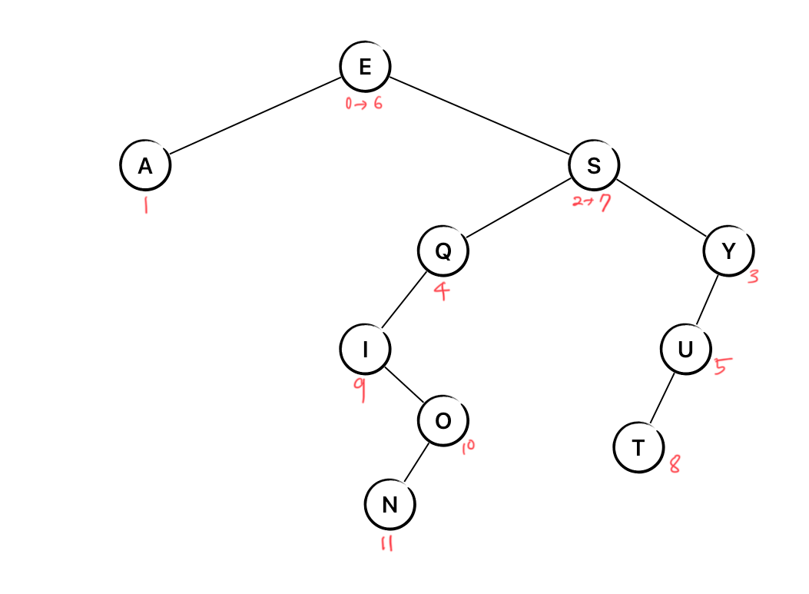

# 자료구조와 알고리즘 4주차 과제 - 이진 탐색 트리

1. 다음의 키/값 쌍들이 이진 탐색 트리로 구현된 순차 심볼 테이블에 추가되었을 때
   어떤 모양인지 그림을 그려서 풀 리퀘스트에 이미지를 올려주세요.

```
E: 0
A: 1
S: 2
Y: 3
Q: 4
U: 5
E: 6
S: 7
T: 8
I: 9
O: 10
N: 11
```

2. 트리의 높이를 구하는 height를 구현해 주세요. 이때 2가지 버전의 구현을 만들어
   주세요. 첫 번째는 재귀로 실행할 때마다 새로 계산해서 높이를 구하는 버전을
   만들어 주세요. 두 번째는 `size()`와 비슷하게 각 노드에 트리의 높이를 담는
   필드 변수를 활용해서 구현한 버전을 만들어 주세요.
