# 자료구조와 알고리즘 4주차 과제 - 균형 탐색 트리

1. 다음 키 목록을 순서대로 트리에 추가했을 때 만들어지는 2-3 트리를 그려주세요.

```
E A S Y Q U T I O N
```


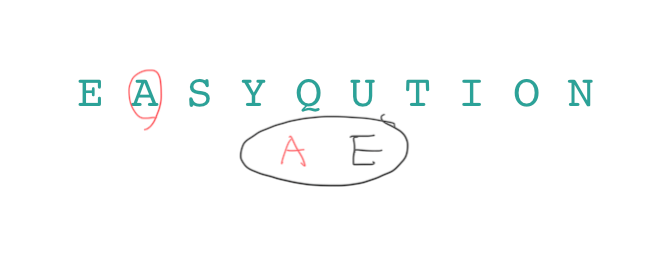

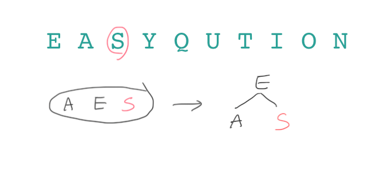

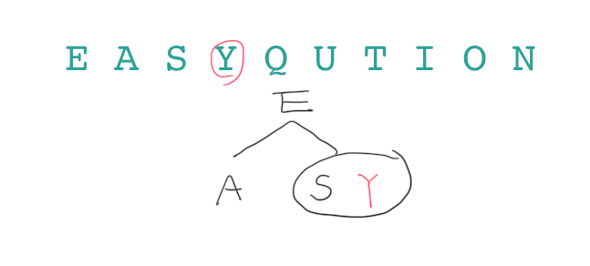

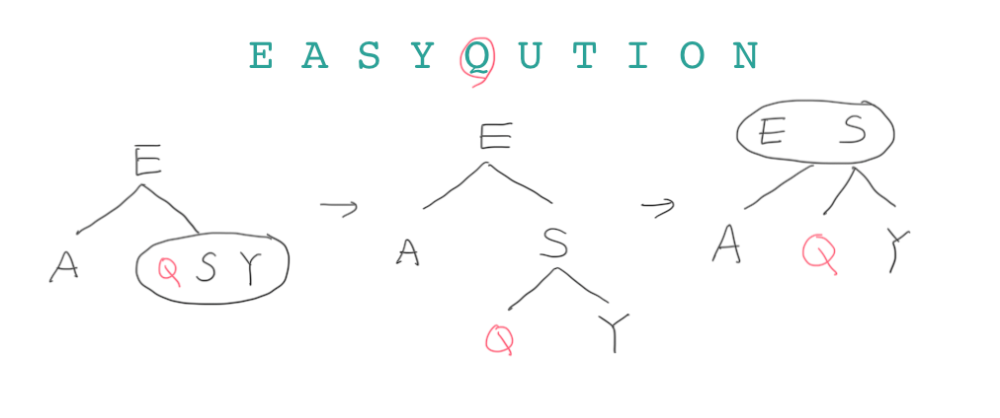

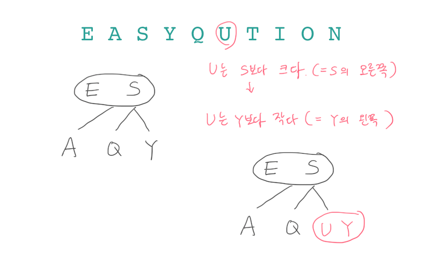

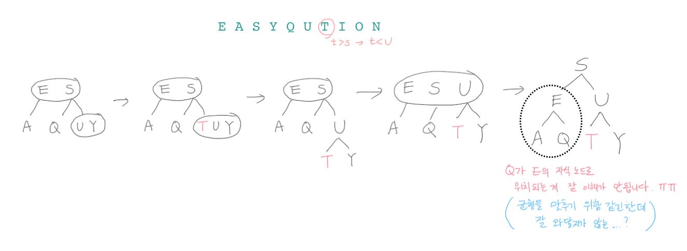

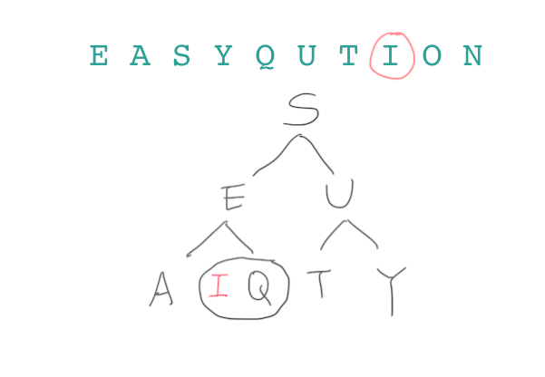

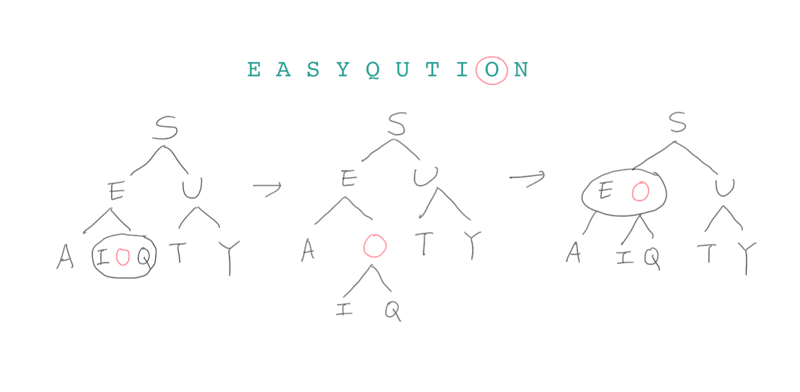

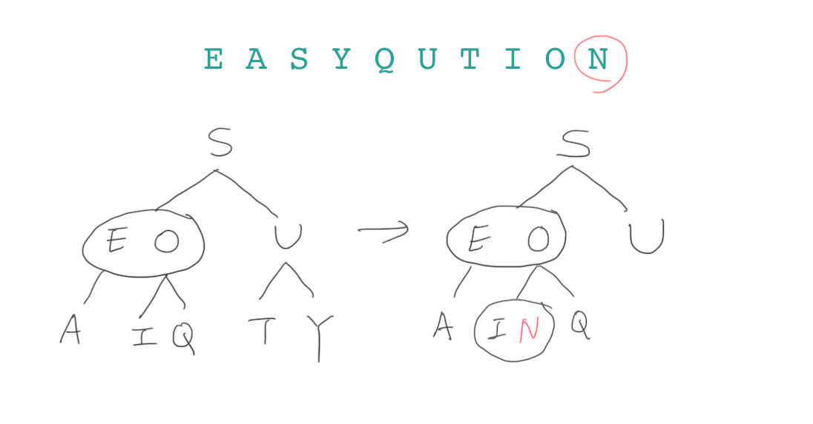


2. 이번에는 위의 키 목록을 레드 블랙 트리에 순서대로 추가했을 때 만들어지는 레드
   블랙 트리를 그려주세요.

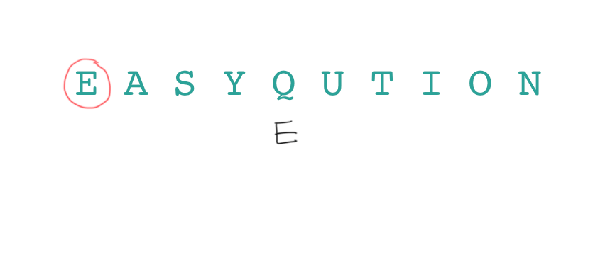

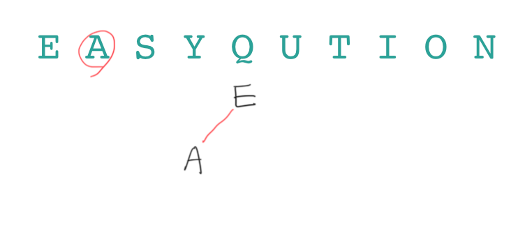

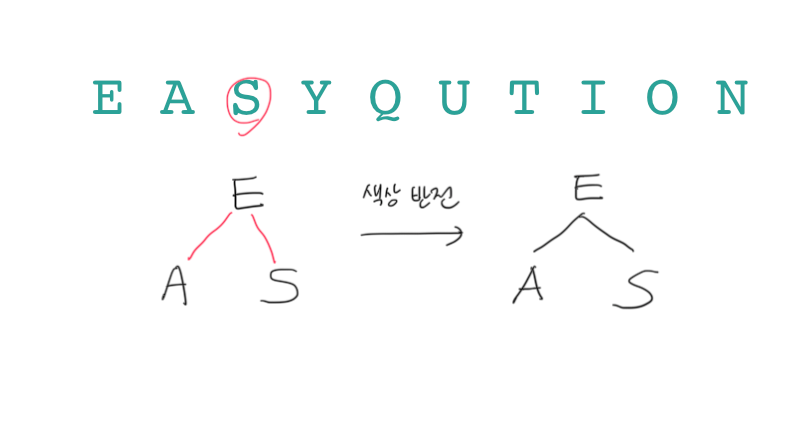

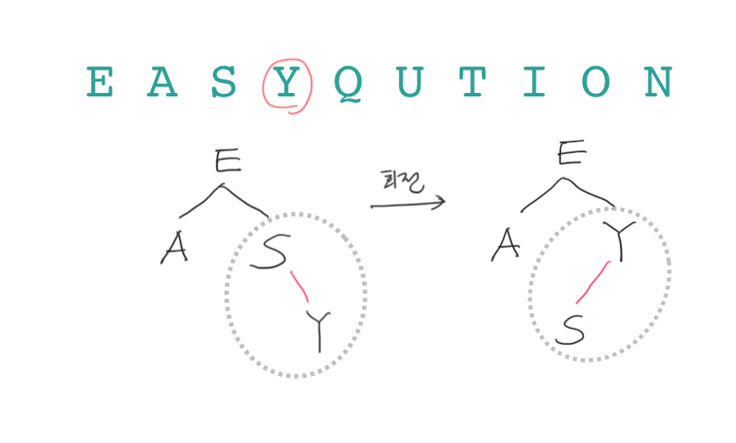

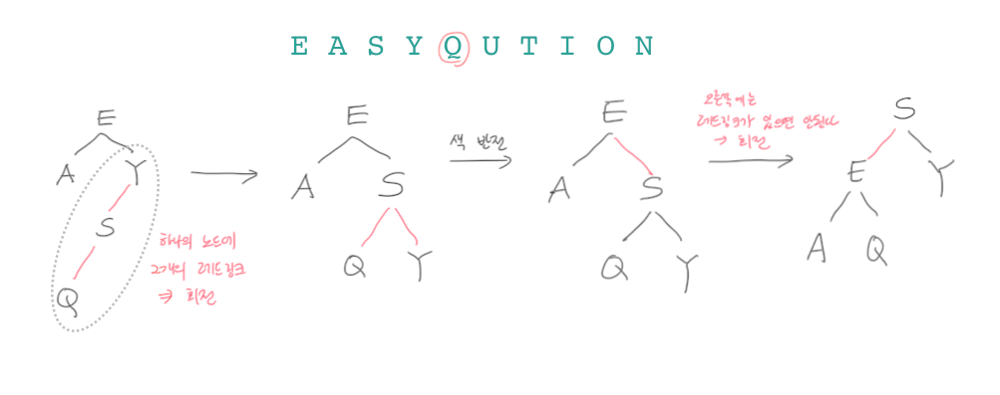

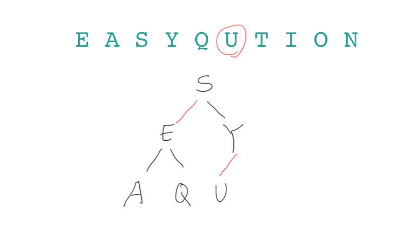

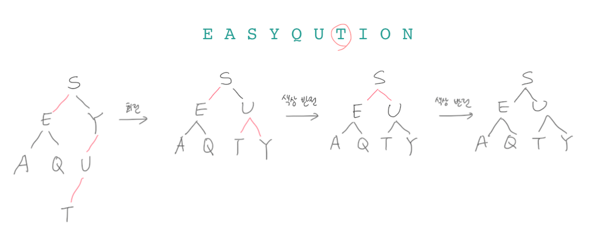

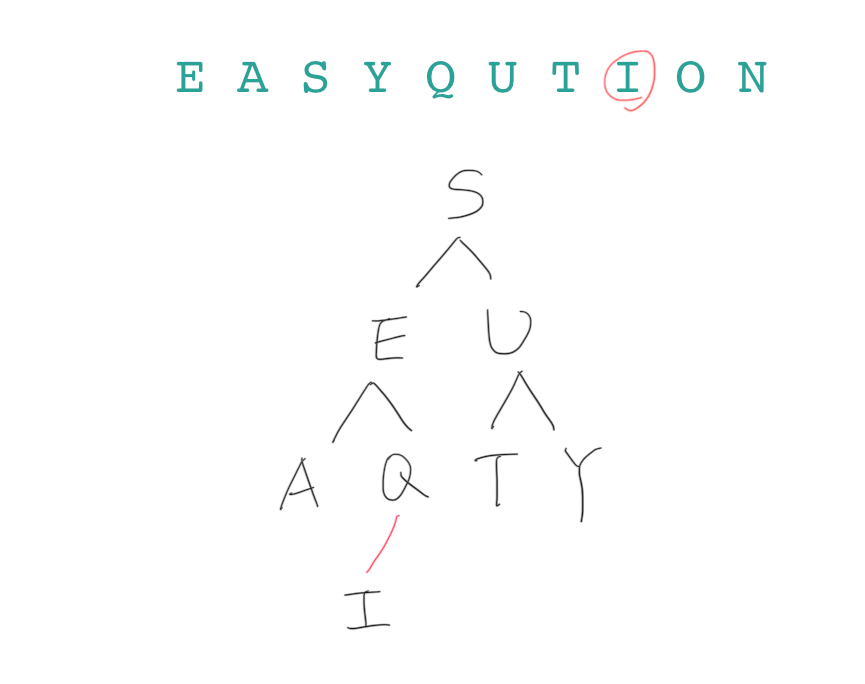

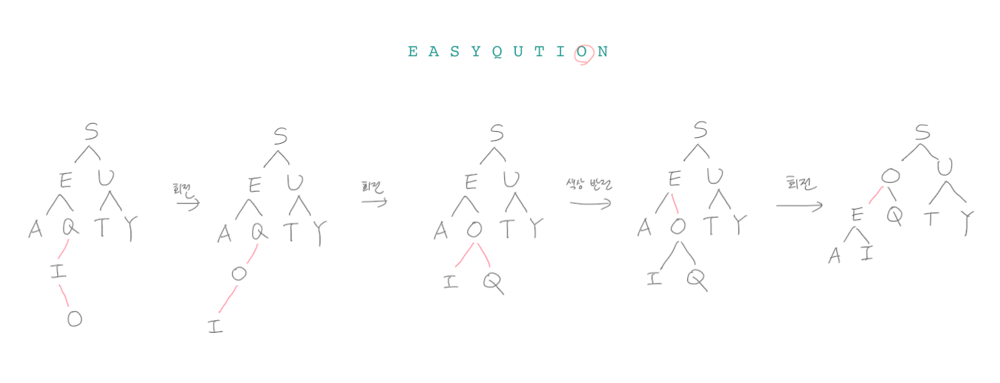

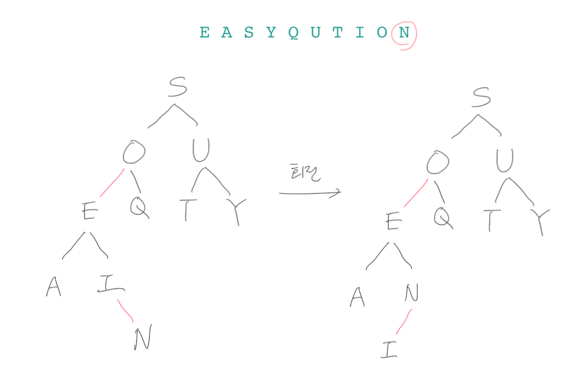
